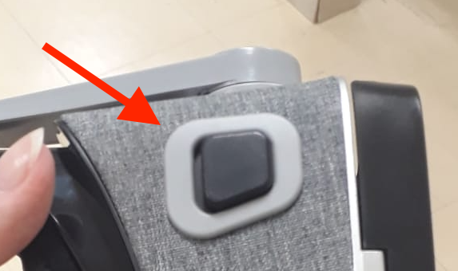

# Unidade 3

Local para postar a atividade da unidade 3.  

## Roteiro de apresentação

### Teórica

Apresentação deve constar:

- [ ] assunto para desenvolver o Projeto da disciplina  
- [ ] lista das funcionalidades  
- [ ] protótipo de telas (no caso pode ser desenhos de "todos" os espaços da aplicação)  
Nesta apresentação se pode utilizar slides, videos, ou mesmo de aplicações que sejam correlatas a ideia proposta para poder exemplificar o Projeto proposto.

### Prática

- [ ] Aplicação de exemplo usando template padrão disponível no Unity Hub: VR Core  
- [ ] Aplicação de exemplo usando: <https://developers.google.com/cardboard?hl=pt-br>  
- [ ] Exemplo de aplicações usando o Oculus VR para smartphone [nosso](OculusVR)  
- [ ] Aplicação de exemplo usando o controle do Oculus VR  
- [ ] Mostrar quais Assets vai usar para modelar o cenário do projeto  

Podem explorar 3 formas de interação diferentes:

- controle virtual na cena  
- controle remoro externo por bluetootch  
- botão no OculusVR  
  

## 2023-04-27 - 19:31

Já dividiram as tarefas.  
Já tem um HMD+controle.  
Já tem os Assets para usar: Synty Studios  
Já mencionei que podem pedir ajuda para o Júlio/Martha de como usar o controle no Unity.  

## Assets escolhidos pela turma

Este foi comprado.  
<https://assetstore.unity.com/packages/3d/environments/modular-horror-hospital-maze-206310>  
Usar para acessar:  

```
  Usr: dalton.reis@gmail.com  
  Pwd: Furb2022  
````

Tem um projeto de exemplo em: [ModularHorrorHospitalMaze](ModularHorrorHospitalMaze)  

Este era muito antigo: 2016 - Unity 5.5.0  
<https://assetstore.unity.com/packages/3d/environments/sewer-maze-77049>  

## Assets

### SimpleApocalypse

[SimpleApocalypse.unitypackage](SimpleApocalypse.unitypackage)  

<https://assetstore.unity.com/packages/3d/environments/simple-apocalypse-cartoon-assets-44678>  
